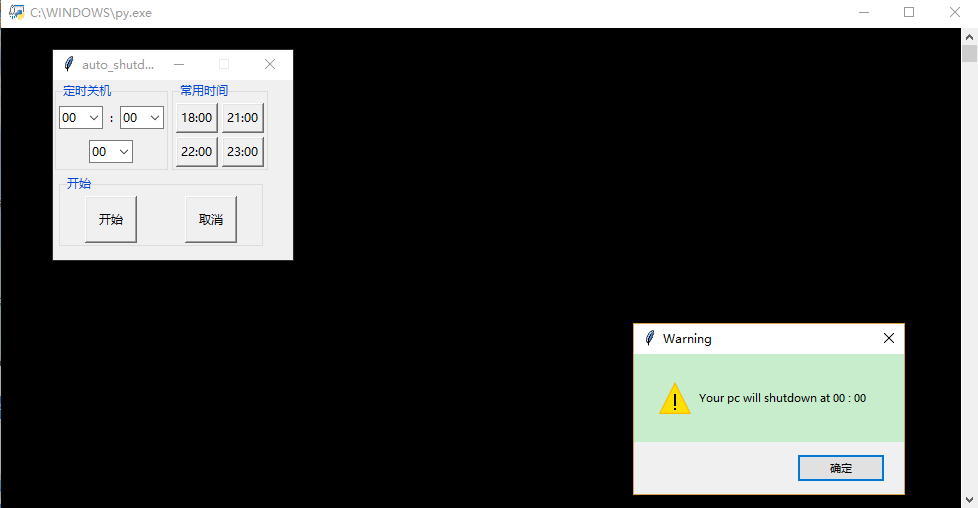

#tkinter_Object
#auther:wake_up_smiling
#email:1173341726@qq.com

this is the appearance of the routine:
======

How to use:
======

1.Run program auto_shutdown.py
------
2.Run executable program(windows) in ./dist/auto_shutdown.exe
----